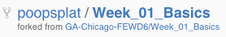
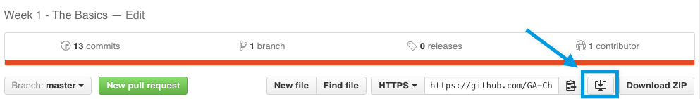
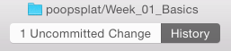
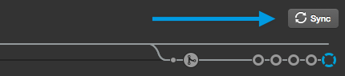

#FEWD Assignment Submission
A step-by-step guide on how to submit assignments, and ask for feedback.

## Submitting a Pull Request
We will be using Github to submit all of our assignments — we've already discuessed the benefits of using Github, and _Pull Requests_ are part of those benefits.

###What is a Pull Request?
When working on a repo with multiple developers, it's a commone practice to commit your own work to a new branch off of the master branch (or in our case, to commit your work to a _fork_ of a master repo), and when that work is completed and ready to be integrated with the master branch (or fork), you submit a "Pull Request", which is doing exactly that: requesting that the manager of the repo pull your commited code into the master branch/fork. This step is really helpful when working on a team because the pull request gives the manager of the repo an opportunity to do a _code review_; to look at the work that is being submitted, check it for any errors, and give feedback to the submitter in the case that any fixes need to be made.

This is how we will be submitting our assignments.

##Step 1: Fork the Week's Repo
Navigate to the [GA-Chicago-FEWD6](https://github.com/GA-Chicago-FEWD6) organization, and select the current week's repo (example: `Week_01_Basics`). When on the repo page, click on the "fork" button in the upper-right:

##Step 2: Clone your Fork onto Your Computer
In order to work on our code we need it on our computer, so next we need to clone the repo onto our machine. First, make sure you're on the webpage of the fork you made, not the original repo. You should find your forked version listed in your own profile, but just make sure the repo you are about to clone shows that it is a fork of another repo:

Then click on the "save to your computer and use it in Github Desktop" button, which looks like a desktop with an arrow chopping it in half:

At least one person has reported issues with this method, so alternatively, you can clone your forked repo from within the Github desktop application itself, by clicking on the "add repo" button, selecting "clone", and finding the forked repo that you want to clone:

##Step 3: Setup and Work on Files
Once your have your forked repo cloned onto your machine, open up the  folder in finder or explorer. If you're not sure where they're located (you should be because they should all be cloned to a class folder!) you can right click on the name of the repo in the sidebar of the Github desktop app and select "open in finder":

Once we start working on the files in the lessons' `starter_code` folder, we will be saving our progress to the related `solution_student` folder. Each lesson will have an empty `solution_student` folder, as will the week's `assignment` foler, which is where you will place your assignment files. Sometimes there will be multiple exercises in a lesson, and therefore the `solution_student` folder should contain a folder for each exercise:

Sometimes we will create the files from scratch, and other times it would be most helpful to just copy the exercise folder from the `starter_code` folder into the `solution_student` folder.

When working on the assignment we will follow the same guidelines: save your assignment files in the `assignment/solution_student` folder. For the assignments it will often make the most sense to copy the files and folders in the `assignment/starter_code` folder over to your `assignment/solution_student` folder to start working from:

From there just do your work!

##Step 4: Commit and Sync Your Work
When you are finished working on the exercise or assignment you can commit your changes in the Github desktop app. Remember to look up at the top bar and click on the tab that says "X Uncommitted Change(s)":

From there you can select the files you want to include in the commit, which will most likely be all of them, and then add a commit summary, and description, and then click "Commit to master":

Don't forget to "sync" your changes from your desktop clone to the remote repo by clicking on teh "sync" button near the top-right:

From here it might be a good idea to visit your forked repo on github.com again to make sure the committed changes and sync worked. If they did, you should see a message near the top of your repo reporting the latest commit you made:

Congrats! So close to being done...

##Step 5: Submitting the Pull Request
Okay, we're finally here, submitting a pull request! So, you might have noticed that there is a "Pull Request" button at the top-right of your Github desktop app, but I find it to be weird, and harder to understand exatly what's going on, so I recommend doing it from the repo page on github.com instead. So navigate to your forked repo (which should still be open from the last step), and find the big 'ol green "New pull request" button:

Go ahead, click it! You'll be brought to a page that should look similar to the following:

By default it should show the `GA-Chicago-FEWD6` repo as the "base fork", and list your forked repo as the "head fork". Underneath all of this will be a breakdown, file-by-file, of all of the changes you are submitting. Just make a quick double-check to make sure you've committed all of your work, and then click the big 'ol "Create pull request" button. From here it will ask you to fill out a pull request title and description. Title your pull request appropriately, and feel free to point out any questions or comments you had on the submission in the description, because I will see these messages and will be able to address your concerns in my feedback:

If you really want to get fancy, you can add a label to your pull request! You can label it as an `assignment submission`, an `exercise submission` (if you specifically want feedback on your exercise, though because we go over the exercises during class you don't need to submit them). There is also a `help wanted` and `question` label for submitting issues, which will be helpful for peer review and class discussion (I'll show you that later):

Go ahead and click on that big 'ol green "Creat pull request" button again to complete the submission.

**Congrats!** You did it!

##Step 6: Feedback
I will recieve a notification for your pull request, and from there I can review your code and give you feedback, on a line-by-line basis, and summaraized in a comment. We can have a back-and-forth discussion in the comments of the pull request if needed as well, but after I've given you your feedback I will close the pull request, and you'll recieve a notification that I've commented and closed your pull request:

If I request revisions from you, or you'd like to make revisions for further feedback, you can then just make your changes, and submit a new pull request.

In a real-world scenario, if the code you submitted for a pull-request was reviewed, tested, and approved, I would _merge_ the pull request, and pull it in as part of the master branch or repo. We won't be doing that in the class because we want to keep everyone's work separated.

##Good job! :)

